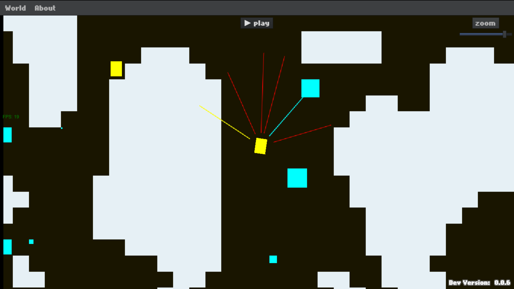

# FlxEchoSensorCasts

A project where I try to simulate some entities in an environment that use echo linecasts as periodic environment sensors.

Built using Haxe + HaxeFlixel + Echo (physics) + HaxeUI (interface).

## Screenshot

## Live Build - Broken :(

Check out the [latest html5 build of the project](https://Gioele-Bencivenga.github.io/FlxEchoSensorCasts) if you want, but know that it may be broken and/or stuck to an older version of the project.
